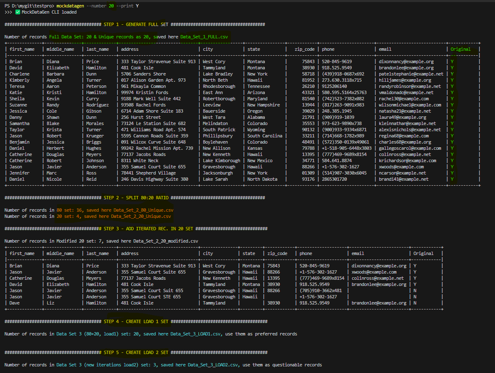
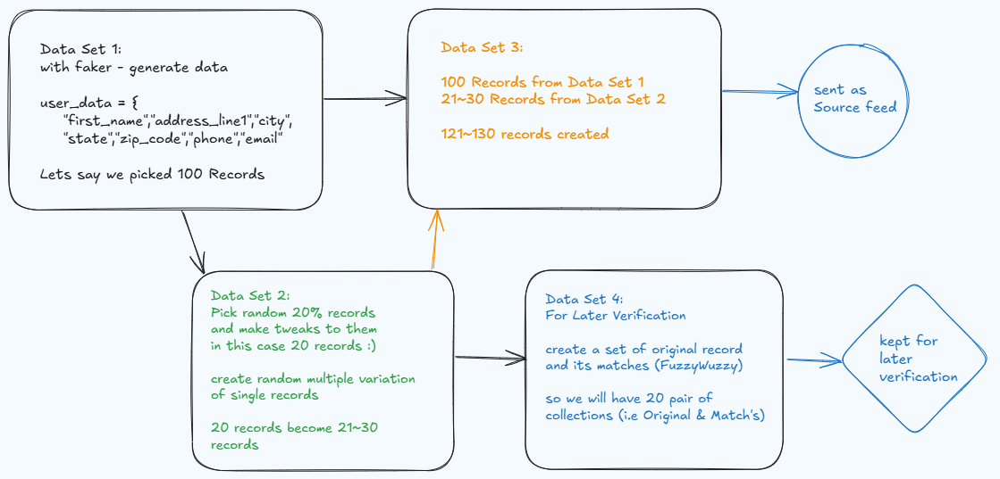

<h4>Description</h4>

This Python project provides a robust solution for generating synthetic datasets tailored for Master Data Management (MDM) testing and data integration projects. 

<ul>
  <li>User can run a simple command from CLI to determine the size of the test datasetBy taking user input to determine dataset size</li>
  <li>We then Split the Data set into two subset in 20 & 80 Weight Ratio, we leave the 80% Dataset untouched</li>
  <li>We then take the 20% dataset, randonly pick records and make familair edits (Jennifer replaced by Jenn or David by Dave, Street by ST, Avenue by Ave. or Apartment by Apt. or #)</li>
  <li>When we edit and add such altered records to the 20% set, we have carefully marked Original records with the use of Indicator. This helps in Later Validations.</li>
  <li>In the end we have several Dataset, But user is presented with two main <em>Dataset {Data_Set_3_LOAD1.csv}</em> will be good trusted records and <em>Dataset {Data_Set_3_LOAD2.csv}</em> with mixed corrupted data </li>
</ul>

In the end we have a realistic test bed for assessing record matching, data cleansing, and standardization workflows. The ability to test how systems handle inconsistencies and merge similar records (MDM use case) is invaluable for improving data quality, ensuring seamless integration, and refining entity resolution processes. This tool is especially beneficial for evaluating record matching algorithms and validating data governance strategies in enterprise environments.

<h4>Usage</h4>

<h4>Help Options :</h4>
<em>mockdatagen --help </em>

<h4>Generate 10 records with no display on screen :</h4>
<em>mockdatagen --number 10 --print N </em> 

<h4>High Level Conceptual Data Flow Diagram:</h4>

<h4>Release history</h4>

<li>Version 1.0.0 - Date 6/14/2025 { Run CLI Command like mockdatagen --number 10 --print N } </li>
<li>Version 1.1.0 - Date 6/15/2025 { Added Unit test cases, Pylint for quality and github actions} </li>

<h4><a href="https://pypi.org/project/mockdatagen/">pypi.org Web Portal URL</a></h4>

<h4>======================= Developers Notes ======================</h4>

<h4>Dynamic Update Pylint & Coverage Badge via shell script</h4>

<em>pylint_badge.sh</em>

<h4> Tree </h4>

<em>tree /F /A > tree_output.txt </em>

<h4> pylint local run </h4>

<em>uv run pylint myapp > pylint_report.txt || true</em>

<h5><a href="https://profile.dataguruankit.com/Portfolio.html">Back to Portfolio!</a></h5>
